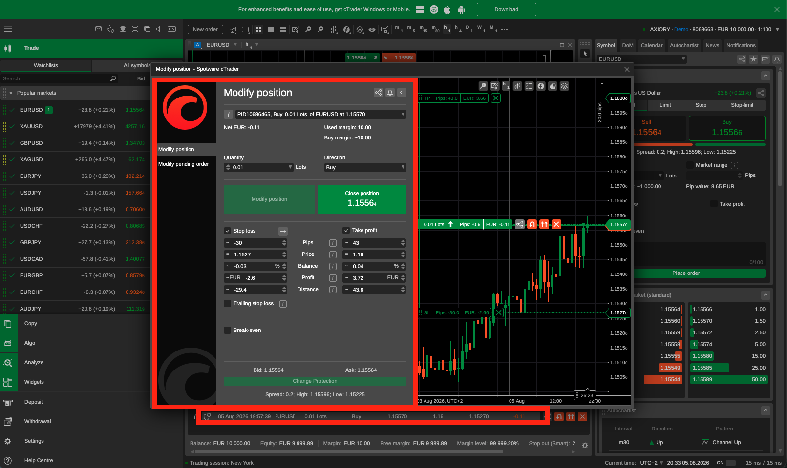

# Manual test guide

## 1. Before you start

- Node.js 22+ (`node --version`)
- A cTrader remote MCP token (cTrader Web → Settings → Remote MCP)

```bash
npm install
```

## 2. Wire into an agent

Add both servers to your MCP client's config:

```jsonc
{
  "mcpServers": {
    "ctrader": {
      "type": "http",
      "url": "https://mcp.ctrader.com/data/mcp",
      "headers": { "Authorization": "Bearer <your-slug>" }
    },
    "preflight": {
      "command": "npx",
      "args": ["tsx", "src/server.ts"],
      "cwd": "/absolute/path/to/purple-preflight-agent"
    }
  }
}
```

`ctrader` points at `/data/mcp`, not `/trading/mcp`. Your agent can read balances and
prices directly, but has no tool that can place, amend, or close anything — only
Preflight does. Restart your agent session for the config to take effect.

Ask your agent to place a EURUSD buy with no stop loss. It refuses. Ask it to place the
same order with a stop. It goes through.

### Seeing the result

Log into [`app.ctrader.com`](https://app.ctrader.com/) with the account's cTID and open
the position:



This is the actual position Preflight opened. The order-history line at the bottom —
`05 Aug 2026 19:57:39 EURUSD 0.01 Lots Buy 1.15570 1.16 1.15270` — matches
`journal/decisions.jsonl` to the second: an `ALLOW` at `17:57:40 UTC`, then an
`amend_position` adding the take-profit, then a `DENY` on the same call for trying to
remove it (the Q-R10 case — see [`docs/platform-findings.md`](platform-findings.md)).

The **Stop loss** and **Take profit** checkboxes in this panel are the human-facing
version of that same trap: unchecking one and submitting is the same silent-deletion risk
Preflight catches on the API side.

## 3. Terminal

The same four decisions, without an agent. From the repo root:

**No stop loss — refused**

```bash
set -a; . ./.env; set +a
printf '%s\n%s\n%s\n' \
 '{"jsonrpc":"2.0","id":1,"method":"initialize","params":{"protocolVersion":"2025-06-18","capabilities":{},"clientInfo":{"name":"manual-test","version":"1"}}}' \
 '{"jsonrpc":"2.0","method":"notifications/initialized"}' \
 '{"jsonrpc":"2.0","id":2,"method":"tools/call","params":{"name":"create_order","arguments":{"symbolId":1,"orderType":"MARKET","tradeSide":"BUY","volume":100000}}}' \
 | npx tsx src/server.ts 2>/dev/null | python3 -c "
import sys,json
for line in sys.stdin:
    line=line.strip()
    if line.startswith('{'):
        o=json.loads(line)
        if o.get('id')==2: print(o['result']['content'][0]['text'])
"
```

```
DENY: BUY MARKET order carries no stop loss; policy requires one. Set relativeStopLoss (points from fill price).
mode=enforce forwarded=false
```

**Same order, with a stop — placed** (real position on the demo account)

```bash
set -a; . ./.env; set +a
printf '%s\n%s\n%s\n' \
 '{"jsonrpc":"2.0","id":1,"method":"initialize","params":{"protocolVersion":"2025-06-18","capabilities":{},"clientInfo":{"name":"manual-test","version":"1"}}}' \
 '{"jsonrpc":"2.0","method":"notifications/initialized"}' \
 '{"jsonrpc":"2.0","id":2,"method":"tools/call","params":{"name":"create_order","arguments":{"symbolId":1,"orderType":"MARKET","tradeSide":"BUY","volume":100000,"relativeStopLoss":300}}}' \
 | npx tsx src/server.ts 2>/dev/null | python3 -c "
import sys,json
for line in sys.stdin:
    line=line.strip()
    if line.startswith('{'):
        o=json.loads(line)
        if o.get('id')==2: print(o['result']['content'][0]['text'])
"
```

```
ALLOW: 1 rule(s) passed
mode=enforce forwarded=true
```

**Over the per-symbol lot limit — refused**

```bash
set -a; . ./.env; set +a
printf '%s\n%s\n%s\n' \
 '{"jsonrpc":"2.0","id":1,"method":"initialize","params":{"protocolVersion":"2025-06-18","capabilities":{},"clientInfo":{"name":"manual-test","version":"1"}}}' \
 '{"jsonrpc":"2.0","method":"notifications/initialized"}' \
 '{"jsonrpc":"2.0","id":2,"method":"tools/call","params":{"name":"create_order","arguments":{"symbolId":1,"orderType":"MARKET","tradeSide":"BUY","volume":20000000,"relativeStopLoss":300}}}' \
 | npx tsx src/server.ts 2>/dev/null | python3 -c "
import sys,json
for line in sys.stdin:
    line=line.strip()
    if line.startswith('{'):
        o=json.loads(line)
        if o.get('id')==2: print(o['result']['content'][0]['text'])
"
```

```
DENY: 2 lots EURUSD exceeds limit 1 lots (volume 20000000 / (lotSize 100000 x 100) = 2)
mode=enforce forwarded=false
```

**Tightening a stop that would delete the take-profit — refused** (needs an existing
position with both legs set — the one from the previous test, or `symbolId: 41` for
XAUUSD to see the lot-size difference)

```bash
set -a; . ./.env; set +a
printf '%s\n%s\n%s\n' \
 '{"jsonrpc":"2.0","id":1,"method":"initialize","params":{"protocolVersion":"2025-06-18","capabilities":{},"clientInfo":{"name":"manual-test","version":"1"}}}' \
 '{"jsonrpc":"2.0","method":"notifications/initialized"}' \
 '{"jsonrpc":"2.0","id":2,"method":"tools/call","params":{"name":"amend_position","arguments":{"positionId":<YOUR-POSITION-ID>,"stopLoss":1.1530}}}' \
 | npx tsx src/server.ts 2>/dev/null | python3 -c "
import sys,json
for line in sys.stdin:
    line=line.strip()
    if line.startswith('{'):
        o=json.loads(line)
        if o.get('id')==2: print(o['result']['content'][0]['text'])
"
```

```
DENY: amend of position <id> would remove takeProfit 1.16 — amend_position deletes omitted legs rather than preserving them (Q-R10). Re-pass that value to preserve it.
mode=enforce forwarded=false
```

**Reading decisions back**

```bash
tail -5 journal/decisions.jsonl | python3 -m json.tool --json-lines
```

**Running the automated suite**

```bash
npm test
```

Config, modes, and outcome classes: [`docs/architecture.md`](architecture.md).
Design standards behind the reason strings: [`docs/design-standards.md`](design-standards.md).
